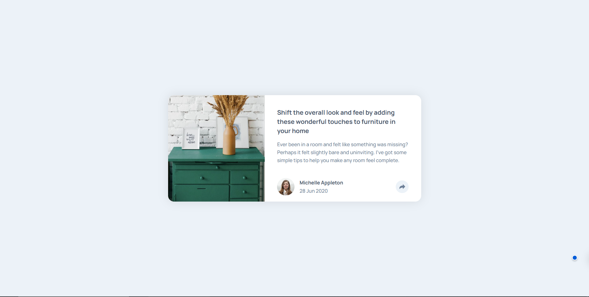

# Frontend Mentor - Article preview component solution

This is a solution to the [Article preview component challenge on Frontend Mentor](https://www.frontendmentor.io/challenges/article-preview-component-dYBN_pYFT). Frontend Mentor challenges help you improve your coding skills by building realistic projects. 

## Table of contents

- [Overview](#overview)
  - [The challenge](#the-challenge)
  - [Screenshot](#screenshot)
  - [Links](#links)
- [My process](#my-process)
  - [Built with](#built-with)
  - [What I learned](#what-i-learned)
  - [Continued development](#continued-development)
  - [Useful resources](#useful-resources)
  - [AI Collaboration](#ai-collaboration)
- [Author](#author)
- [Acknowledgments](#acknowledgments)

## Overview

### The challenge

Users should be able to:

- View the optimal layout for the component depending on their device's screen size
- See the social media share links when they click the share icon

### Screenshot



### Links

- Solution URL: [Solution URL](https://github.com/zardalt/article-preview-component)
- Live Site URL: [Live Site URL](https://your-live-site-url.com)

## My process

### Built with

- Semantic HTML5 markup
- CSS custom properties
- Flexbox
- Mobile-first workflow

### What I learned

This project was under the beginner JavaScript section. We were told to use JavaScript to replicate popovers but I used this opportunity to actually learn about setting up popovers with the `popover` and the `popovertarget` attribute as well as positioning the popover using `position-anchor`. It was a fun project and I definitely learned something new.

BTW, did you know 
```css
position: absolute
```
doesn't work with popovers so the only way to position a popover relative to another element is with
```css
position: anchor
```
Took me a while to figure that one out.

### Continued development

In future projects, I'll want to improve on my speed and ability to make sound design decisions faster as making wrong decisions on what styles to write slows you down as you'll have to start over if it doesn't work.

## Author

- Frontend Mentor - [@zardalt](https://www.frontendmentor.io/profile/zardalt)
